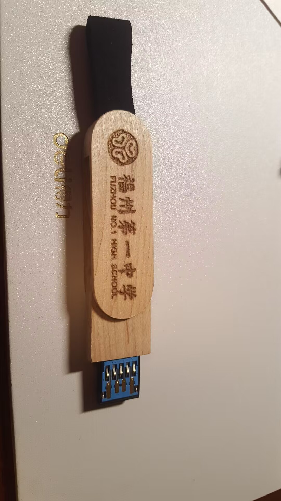
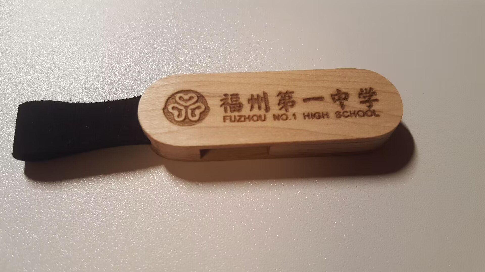

# 主推

## PCB尺子

价格12

镀金工艺

## U盘

售价39

* USB3.2

* 容量64G

* 速度（循序读写）120/30
* 木质旋转外壳，正面是福一LOGO
* 背面可自定义刻字内容，需加5块钱
* 外壳多种材质可选

## 明信片

照片还没拍

售价6

一套10张，总之是福一主题

## 定制卡贴

[图案在这](image/卡贴)

流浪地球风格的，有三种款式，每款都分正面背面

正面是统一的样式，背面需要买家提供照片姓名我们定制

正面一张5块钱（三款任选），背面一张8块钱

## 定制课程表

图还没拍（

15块钱5片，5片起售

# 其他

## 解压开关

售价9，带灯款（按下会发光）售价10

## 盆栽套装

售价12

有盆、土、种子，很好种的

## WiFi天气时钟

售价29

## 书包挂钩

售价8

## 闹钟

售价14

## 硬件钥匙扣

有CPU和内存条两种，都是12块钱一个

## 玻璃球摆件

售价13

直径6cm，含发光底座

## 月球灯

小号8块钱，大号12

装电池的

## 屏幕清洁器

售价8

## 耳塞

3块钱一对

晚自习/宿舍很好用

## 温湿度计

售价12

## 纸手表

售价12

纸做的表带，外星科技，防水还很耐用

